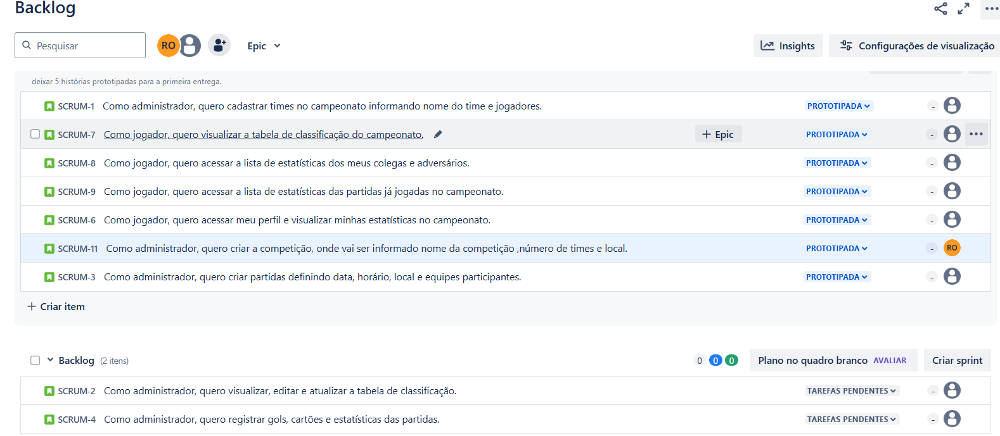
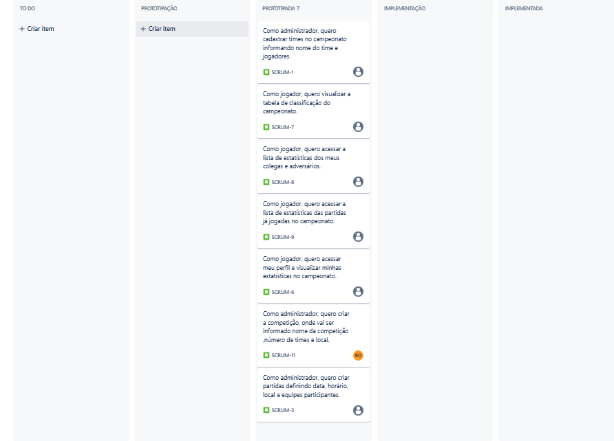
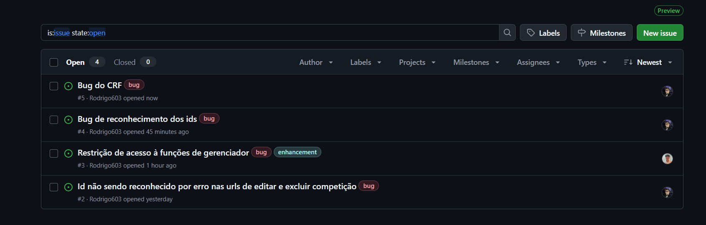
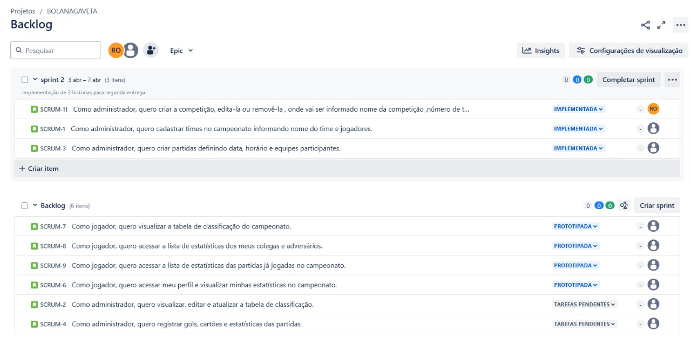
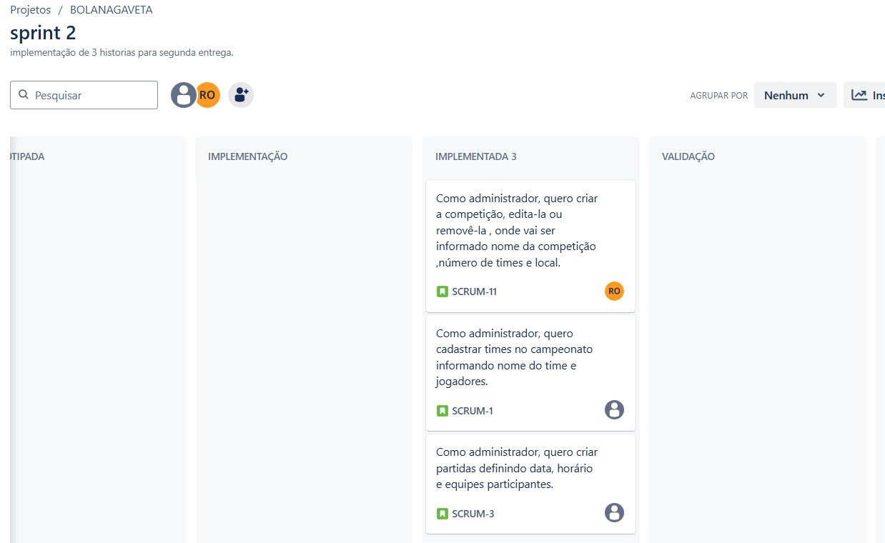
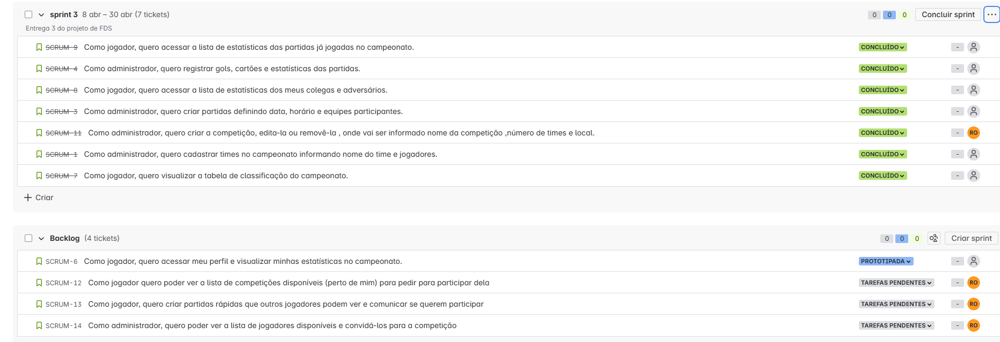
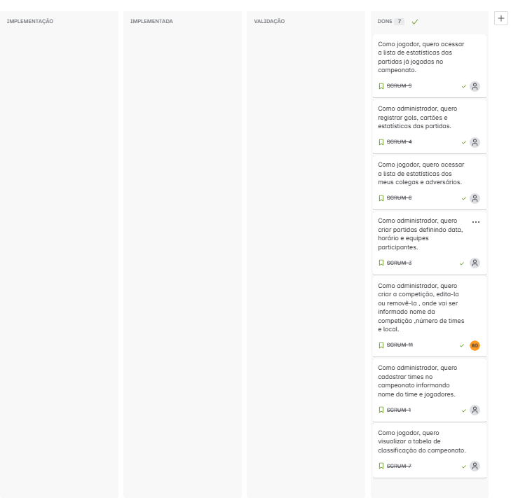
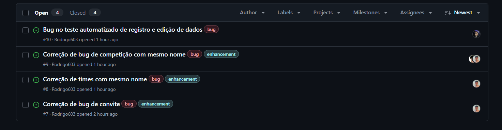
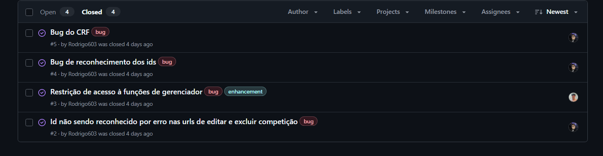

# 🏆 BOLA NA GAVETA

## 📌 Visão Geral
Este é um sistema web desenvolvido em **Django**, projetado para facilitar a organização e administração de campeonatos esportivos. Com essa aplicação, jogadores, administradores e torcedores podem acompanhar as estatísticas, resultados, classificação e muito mais.

## 📑 Funcionalidades
### 🎮 Para Jogadores:
- **Visualizar a Tabela de Classificação:** Acompanhe o desempenho da sua equipe.
- **Estatísticas Individuais:** Veja seu desempenho no campeonato.
- **Ranking de Artilheiros:** Consulte a lista de jogadores com mais gols.
- **Estatísticas de Partidas:** Acesse dados detalhados sobre cada jogo.

### ⚙️ Para Administradores:
- **Cadastro de Times e Jogadores:** Gerencie os participantes do campeonato.
- **Criação de Partidas:** Defina data, horário, local e equipes.
- **Atualização da Tabela de Classificação:** Mantenha os dados do campeonato sempre corretos.
- **Registro de Gols, Cartões e Estatísticas:** Mantenha um histórico detalhado das partidas.

## 👥 Equipe de Desenvolvimento

👨‍💻 Davi Arruda Beltrão - dab@cesar.school

👨‍💻 Gabriel Nascimento Belo Osório - gnbo2@cesar.school

👨‍💻 Jarbas Esteves Assis Neto - jean@cesar.school

👨‍💻 Leandro Veras Padilha Filho - lvpf@cesar.school

👨‍💻 Rodrigo José Dantas de Oliveira - rjdo@cesar.school

👨‍💻 Victor Tien Fah Uen - vtfu@cesar.school

## 📎Links Importantes

  
  
  

## Entregas 

  
✅Entrega 01

  [Screencast](https://www.youtube.com/watch?v=089Hk_P6spY)
  
  [Histórias](https://docs.google.com/document/d/1CfupgNa50fx81Sfj4yjvc8pKxqfcMIGDc83vhO446eg/edit?usp=sharing)

  
  Backlog jira
  
  
  
  Quadro jira 
  

  
✅Entrega 02

   [Screencast](https://www.youtube.com/watch?v=l1HsmqKxHYc&list=PLBgQ_k9pFMTSjSUjmhsSVIZ__GVrn7C3A&index=2&t=8s)

   [Relatório Programação em Par](https://docs.google.com/document/d/1VDtgrqVjuDC7AajdQb2aGRrdOP06M_W2g07NeVBMsKk/edit?tab=t.0)
   
   [Deploy](https://bolanagaveta.azurewebsites.net/)
   
   Bugtracker
   

   Backlog Jira
   
   
   Quadro jira 
   

  
✅Entrega 03

  
  ## Screencasts 

  [Testes Automatizados](https://www.youtube.com/watch?v=urJcFug87Fo)

  [CI/CD](https://www.youtube.com/watch?v=JWGYvew3tE8)

  [Figma](https://www.youtube.com/watch?v=L9Q5eW7Ado0)

  [Deploy](https://www.youtube.com/watch?v=YFI_4zIx9QI)

  ## Jira 

  Backlog Jira
  

  Quadro Jira
  

  ## Bugtracker

  Open
  

  Closed
  

  ## Relatorio em Par

  [Relatorio em par](https://docs.google.com/document/d/1VDtgrqVjuDC7AajdQb2aGRrdOP06M_W2g07NeVBMsKk/edit?tab=t.0)

  

